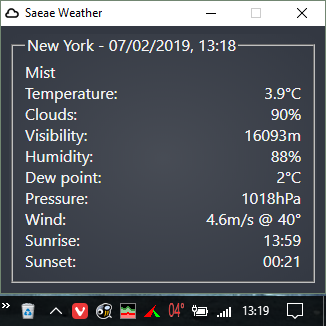
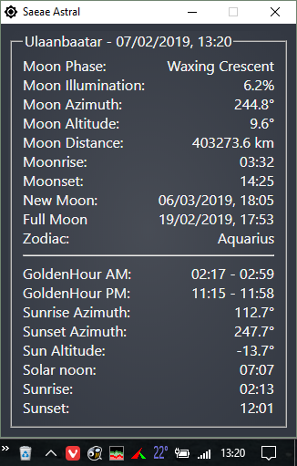
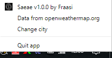

## Saeae (Sää)  
Electron app to show weather temperature in the notification area/system tray.  

  

### Table of contents
* [Install](#Install)
* [Usage](#Usage)
* [City input](#City-input)
* [Other](#Other)
* [Pics](#Pics)

### Install
Windows & linux [releases](https://github.com/Fraasi/Saeae/releases) available.
Downloading and running the installer should put a shortcut to your desktop and launch the app. To have it run on startup, you can put the shortcut here (win10) `C:\Users\<USER_NAME>\AppData\Roaming\Microsoft\Windows\Start Menu\Programs\Startup`.  

### Usage  
Left click tray icon to show/hide weather info window.  
Double click to show/hide astral info window.  
Right click icon for menu to change city, quit app or get back to this readme.  

On weather window, you can click the title date to open forecast for your city in your default browser.  
On astral window, click the title date to get to more info about moon phases.  
On both windows clicking on the city name opens the prompt to change the city.

Data is updated on launch or when the city is changed and then automatically every twenty minutes.  

**Note:** This app does not detect your location. After install you must manually change the default city to your own. The app will remember your city across restarts.

### City input  
For the city input, you can use just a city name, a city name with country code separated by comma or city id number from openweathermap.org.  
For example  
`dresden`  
`dresden, de`  &nbsp;&nbsp;&nbsp;&nbsp;// more precise  
`2935022`  &nbsp;&nbsp;&nbsp;&nbsp;&nbsp;&nbsp;&nbsp;&nbsp;&nbsp;&nbsp;&nbsp;// never wrong city  
are all valid inputs for the city of Dresden in Germany.  
No umlauts: ä -> ae, ö -> oe, ü -> ue.  

### Other  
There's no minus or plus sign in the tray to keep the font size as big and clear as possible, so red color for over 0&deg;C and blue for under.  
The sun and moon information are calculated using [sunCalc](https://github.com/mourner/suncalc) & [lune.js](https://github.com/ryanseys/lune) and might not be entirely accurate. 

### Pics

Weather info window   

Astral info window  
  

Right click menu  
  

<!-- icons from https://www.s-ings.com/typicons/ & material.io/tools/icons-->
