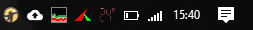
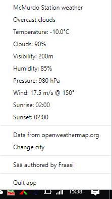
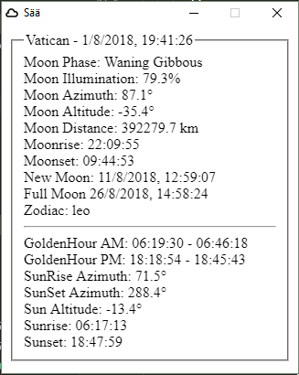

## Saeae (Sää)  
Electron app to show weather temperature in the notification area/system tray.  

  
Windows release only at this time (sorry).

### How to? (updated to coming next [release](#todo-before-next-release))  
Download installer from above link. Running the installer should put a shortcut to your desktop to launch the app. To have it run on startup, you can put the shortcut here (win10) `C:\Users\<USER_NAME>\AppData\Roaming\Microsoft\Windows\Start Menu\Programs\Startup`.  

Left click tray icon to show/hide weather info window,  
double click to show/hide sun and moon info window.  
Right click icon for menu to change city or quit app.  

There's no minus or plus sign to keep the font size as big and clear as possible, so red color for over 0&deg;C & blue for under.

As for the city input, you can use just a city name, a city name with country code separated by comma or city id number from openweathermap.org.  
For example  
`dresden`  
`dresden, de`  
`2935022`  
are all valid inputs for the city of Dresden in Germany.

**Note:** The sun and moon information are calculated using [sunCalc](https://github.com/mourner/suncalc) & [lune.js](https://github.com/ryanseys/lune) and might not be entirely accurate.

### Pics

In tray  

On right click  
  

On double click  
  

#### Todo before next release
* [x] new browserwindow for left click, put weather info there, same style as doubleclick, 'data from & forecast at openweathermap'
* [x] right click menu only github/fraasi, change city & quit app
* [x] input should also take city code, inform about country code if city not found or wrong (notification use?)
* [x] better tray icon font
* [ ] some styles & logo (lets see if J comes up with anything)
* [x] all error codes to left click
* [x] electron-positioner to position both windows to right corner
* [x] different icons for diff wins?
* [x] update deps
* [ ] click firing when double cicking, file an issue
* [x] inform suncalc not always accurate
* [ ] input window fixes
* [ ] update pics & readme

<!-- icons from https://www.s-ings.com/typicons/ & material.io/tools/icons-->
